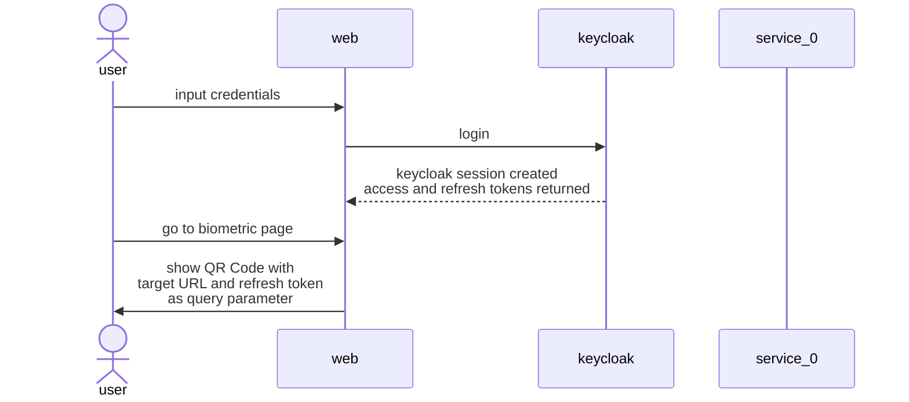
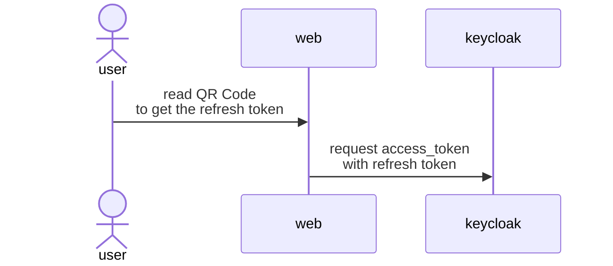
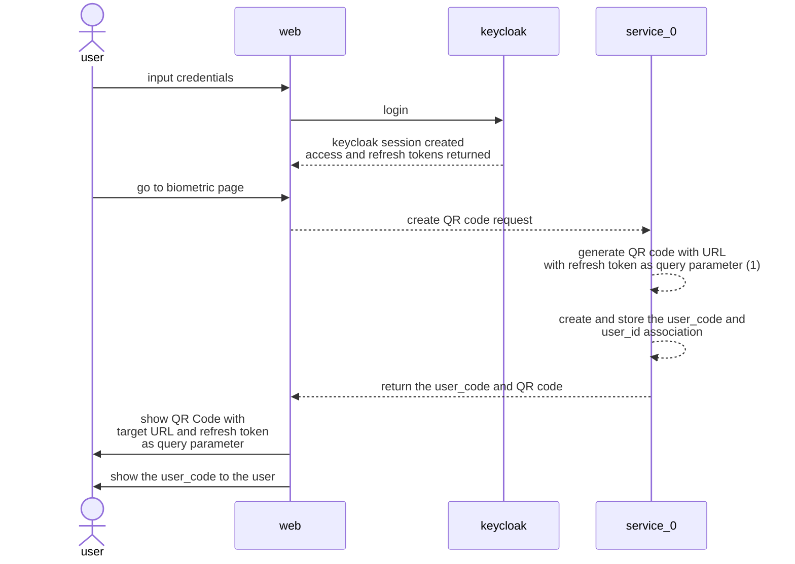
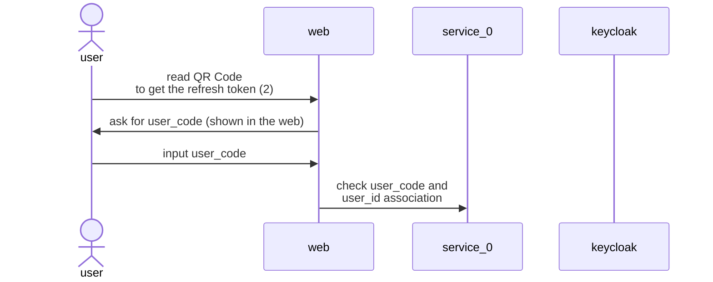

# Authorization Code Flow

## Flow - Refresh token
### desktop

---
### device

---
## Flow - Refresh token and user code
### desktop

---
### device

---
1. The refresh token can be encrypted (aes-128-cbc) to avoid tampering.
2. If the refresh token is encrypted, a request to service_0 is needed to decrypt it.
