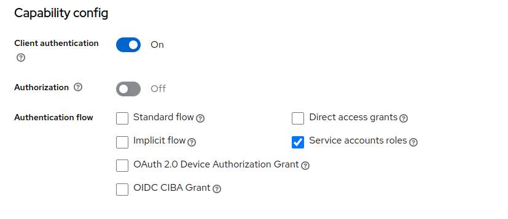
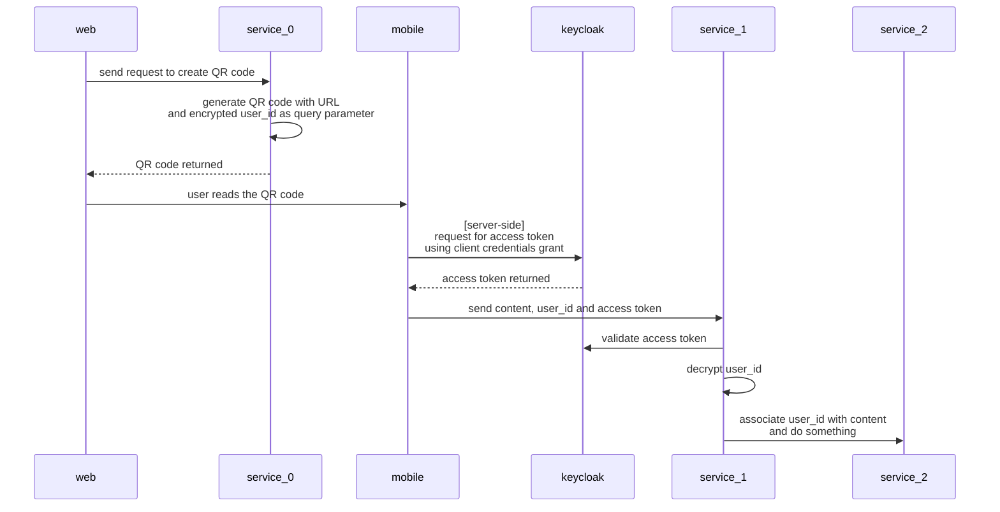

# Client Credentials Grant

- [RFC](https://datatracker.ietf.org/doc/html/rfc6749#section-4.4)

```
     +---------+                                  +---------------+
     |         |                                  |               |
     |         |>--(A)- Client Authentication --->| Authorization |
     | Client  |                                  |     Server    |
     |         |<--(B)---- Access Token ---------<|               |
     |         |                                  |               |
     +---------+                                  +---------------+
```
We can use a **specific client** to authenticate and retrieve an access token. No user information is needed in this flow.




### Sequence flow


### Pros
- the user does not need to authenticate on the mobile
- the QR code will have a short content preventing query parameter length issues
### Cons
- the service_1, service_2 and more services will need to implement a different guard to validate the access token
- if the user wants to continue the flow on the mobile, he will need to authenticate again
- no refresh token to get a new access token [?]

