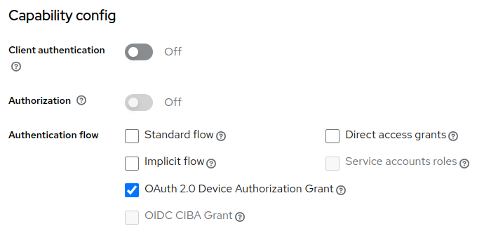
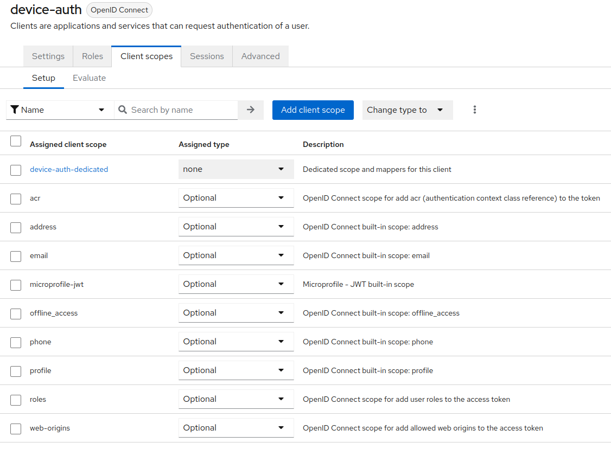
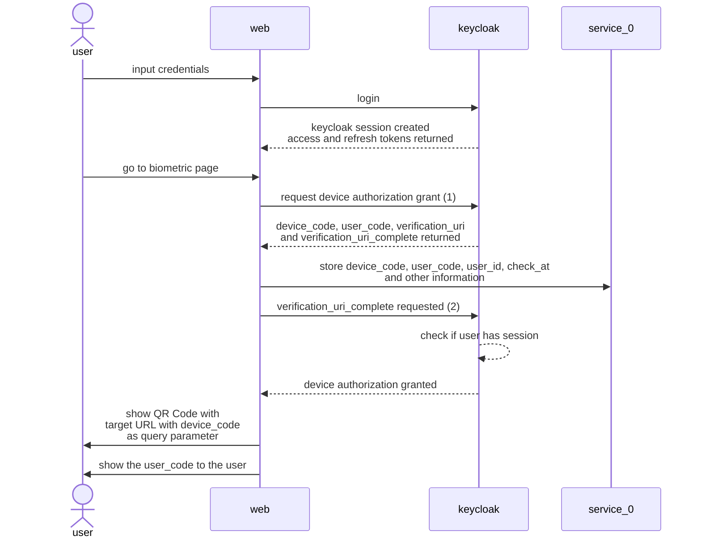
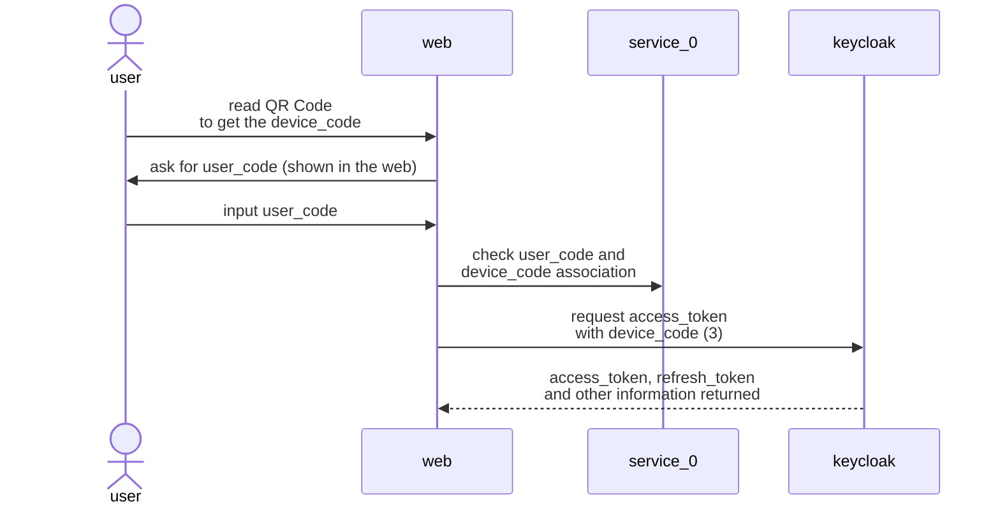
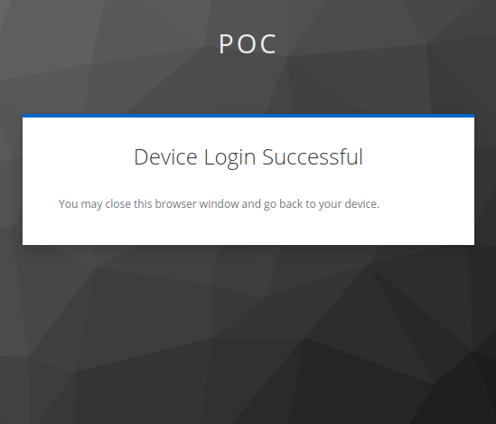

# Device Authorization Grant
### Client configurations


- To prevent the user consent action, the client scopes must be configured as optional:




### desktop

---
### device

---
1. Device authorization grant request
    ```shell
    curl --request POST \
        --url http://host.docker.internal:8080/realms/device-auth/protocol/openid-connect/auth/device \
        --header 'content-type: application/x-www-form-urlencoded' \
        --data = \
        --data client_id=device-auth
    ```

    ```json
    {
        "device_code": "jm-k2R1TW3UDfjeYAaSBu1_dbjIRDBFh71QHAyUGcIs",
        "user_code": "YOJG-BDNT",
        "verification_uri": "http://host.docker.internal:8080/realms/device-auth/device",
        "verification_uri_complete": "http://host.docker.internal:8080/realms/device-auth/device?user_code=YOJG-BDNT",
        "expires_in": 600,
        "interval": 5
    }
    ```

2. The verification_uri_complete returns the device login successful content if the user has an active session:

    `http://host.docker.internal:8080/realms/device-auth/device?user_code=YOJG-BDNT`

    

    If the user does not have an active session, the verification_uri_complete returns the login page (status code 200)

3. Token request
    ```shell
    curl --request POST \
        --url http://host.docker.internal:8080/realms/device-auth/protocol/openid-connect/token \
        --header 'content-type: application/x-www-form-urlencoded' \
        --data = \
        --data client_id=device-auth \
        --data device_code=jm-k2R1TW3UDfjeYAaSBu1_dbjIRDBFh71QHAyUGcIs \
        --data grant_type=urn:ietf:params:oauth:grant-type:device_code
    ```
    ```json
    {
        "access_token": "x",
        "expires_in": 300,
        "refresh_expires_in": 1745,
        "refresh_token": "y",
        "token_type": "Bearer",
        "not-before-policy": 0,
        "session_state": "b4cf914b-f4c1-4f26-a834-e2495ae27afe",
        "scope": "openid email profile"
    }
    ```

### References
- [keycloak.org](https://www.keycloak.org/docs/latest/securing_apps/index.html#device-authorization-endpoint)
- [RFC8628](https://datatracker.ietf.org/doc/html/rfc8628)
