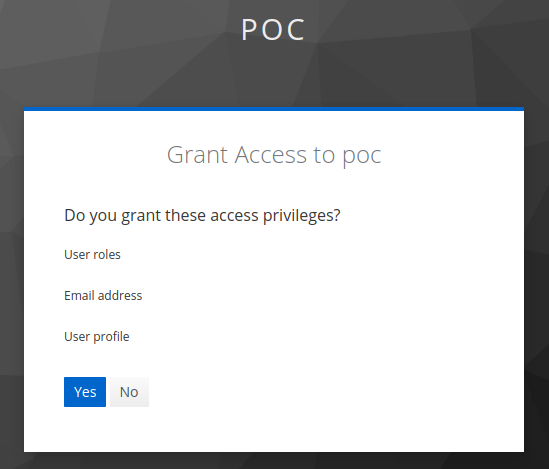
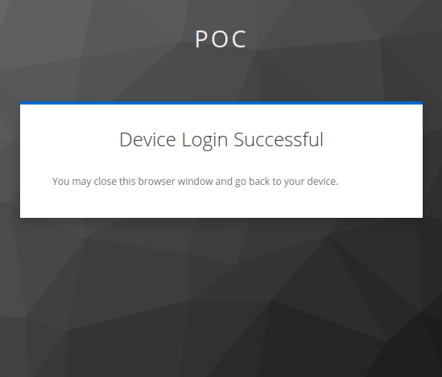

# Device Authorization Grant

1. User logs in the web application
2. User goes to the biometric start page
3. The web application requests the device authorization grant
    ```shell
    curl --request POST \
        --url http://host.docker.internal:8080/realms/poc/protocol/openid-connect/auth/device \
        --header 'content-type: application/x-www-form-urlencoded' \
        --data = \
        --data client_id=poc \
        --data client_secret=SukMA6UgY7boEncAoe55C1eMNBcuvzqJ
    ```

    ```json
    {
        "device_code": "jm-k2R1TW3UDfjeYAaSBu1_dbjIRDBFh71QHAyUGcIs",
        "user_code": "YOJG-BDNT",
        "verification_uri": "http://host.docker.internal:8080/realms/poc/device",
        "verification_uri_complete": "http://host.docker.internal:8080/realms/poc/device?user_code=YOJG-BDNT",
        "expires_in": 600,
        "interval": 5
    }
    ```
4. The web application requests the `verification_uri_complete` in another tab or modal. **The user will be asked to grant access for this action**

    
    
    

5. The web application shows the QR Code with the target URL and the device_code as a query parameter
    
    `http://target.com/biometric?device_code=jm-k2R1TW3UDfjeYAaSBu1_dbjIRDBFh71QHAyUGcIs`

6. The device requests the access_token
    ```shell
    curl --request POST \
        --url http://host.docker.internal:8080/realms/poc/protocol/openid-connect/token \
        --header 'content-type: application/x-www-form-urlencoded' \
        --data = \
        --data client_id=poc \
        --data client_secret=SukMA6UgY7boEncAoe55C1eMNBcuvzqJ \
        --data device_code=jm-k2R1TW3UDfjeYAaSBu1_dbjIRDBFh71QHAyUGcIs \
        --data grant_type=urn:ietf:params:oauth:grant-type:device_code
    ```
    ```json
    {
        "access_token": "x",
        "expires_in": 300,
        "refresh_expires_in": 1745,
        "refresh_token": "y",
        "token_type": "Bearer",
        "not-before-policy": 0,
        "session_state": "b4cf914b-f4c1-4f26-a834-e2495ae27afe",
        "scope": "openid email profile"
    }
    ```

### References
- [keycloak.org](https://www.keycloak.org/docs/latest/securing_apps/index.html#device-authorization-endpoint)
- [RFC8628](https://datatracker.ietf.org/doc/html/rfc8628)
